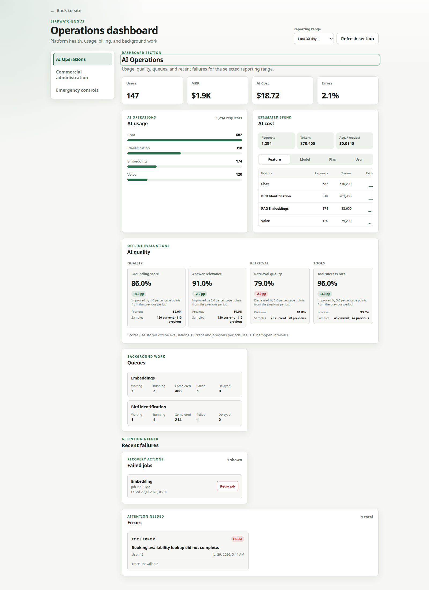

# Birdwatching AI UI

React 18 + Vite frontend for the Birdwatching AI chat experience. The app collects booking-ready customer context, provides a responsive Costa Rica birdwatching assistant UI, and integrates with the Birdwatching AI API for streamed chat responses, voice chat, and conversation retrieval.

## Quick Links
- Project context for AI agents: [CONTEXT.md](./CONTEXT.md)
- Agent coding rules: [AGENTS.md](./AGENTS.md)
- Frontend architecture: [docs/architecture.md](./docs/architecture.md)
- Backend API integration: [docs/api.md](./docs/api.md)
- UI prompting and copy: [docs/prompting.md](./docs/prompting.md)
- Conversation state: [docs/memory.md](./docs/memory.md)
- Deployment: [docs/deployment.md](./docs/deployment.md)
- Product analytics: [docs/analytics.md](./docs/analytics.md)
- Frontend implementation rules: [docs/frontend-guidelines.md](./docs/frontend-guidelines.md)

## Stack
- React 18 with ESM
- Vite 5 and `@vitejs/plugin-react`
- CSS custom properties with utility-minded component classes
- Jest 30 with React Testing Library and jsdom
- Admin Operations Dashboard organized around AI usage, quality, queues, and
  recent failures, with secondary commercial and emergency-control sections
- Railway deployment through Nixpacks

## AI Operations Center



Operational visibility across:

- AI cost
- LLM latency
- RAG quality
- Agent reliability
- Queue health
- Subscriptions

## Local Setup
```bash
npm install
npm run dev
```

Create a local `.env` file with public frontend variables only:
```bash
VITE_API_URL=
VITE_API_PROXY_TARGET=http://localhost:3000
VITE_CLOUDFRONT_BASE_URL=
VITE_POSTHOG_ENABLED=false
VITE_POSTHOG_KEY=
VITE_POSTHOG_HOST=https://us.i.posthog.com
```

Leaving `VITE_API_URL` empty in local development makes the browser call relative backend URLs, which Vite proxies to `VITE_API_PROXY_TARGET` for the configured proxy paths. This avoids local CORS issues while developing against the backend.

Set `VITE_CLOUDFRONT_BASE_URL` only when relative media keys should be rendered directly through a public CDN, for example `https://cdn.example.com`. Leave it empty to keep resolving relative media through the backend `/files` endpoint.

All browser-exposed variables must use the `VITE_` prefix. Do not put backend secrets, OpenAI API keys, database URLs, or private tokens in frontend environment variables.

## Runtime Integration
The UI calls backend APIs through focused adapters in `src/api/`: chat streaming and hydration live in `chatApi.js`, voice chat lives in `voiceChatApi.js`, authentication lives in `authApi.js`, and media URL resolution lives in `mediaApi.js`.

Runtime endpoints used by the browser:
- `POST /auth/signup`
- `POST /auth/login`
- `POST /auth/refresh`
- `POST /auth/logout`
- `PATCH /auth/profile`
- `POST /auth/profile-image`
- `GET /admin/ai-quality` (admin only)
- `GET /admin/users` (admin only)
- `GET /admin/failures` (admin only)
- `POST /admin/jobs/:jobId/retry` (admin only)
- `POST /admin/users/:userId/suspend` (admin only)
- `POST /admin/ai-features/:feature/disable` (admin only)
- `POST /billing/checkout`
- `POST /billing/portal`
- `GET /billing/usage`
- `GET /cart`
- `POST /cart/items`
- `PATCH /cart/items/:itemId`
- `DELETE /cart/items/:itemId`
- `GET /cart/reservations`
- `POST /cart/reservations`
- `POST /chat`
- `POST /voice-chat`
- `POST /birds/identify`
- `GET /jobs/:id`
- `GET /chat/latest`
- `GET /chat/:conversationId`
- `GET /homepage/hero`
- `GET /tours`
- `GET /birds/highlights`
- `GET /birds/profile`
- `GET /addons/transportation`
- `GET /files/:folderName/:filename`

The deployed static server also exposes:
- `GET /health`

Local development note: the current Vite proxy includes `/admin`, `/auth`,
`/billing`, `/cart`, `/chat`, `/voice-chat`, `/homepage`, `/tours`, `/birds`,
`/jobs`, `/addons`, and `/files`.

The backend remains the source of truth for OpenAI, speech-to-text, text-to-speech, RAG, tour tools, discounts, reservations, billing providers, PostgreSQL persistence, and private media storage. This frontend stores only UI conversation state, customer context entered by the user, and a local transcript cache in `localStorage`. Billing UI calls `src/api/billingApi.js` and redirects to backend-returned provider-hosted `paymentUrl` or `managementUrl` values without hard-coding provider objects. When the user records voice, the browser captures audio with `MediaRecorder`, converts it to WAV before upload because the backend accepts MP3/WAV raw audio, and sends it to `POST /voice-chat` with conversation context headers and `X-Response-Mode: field_assistant`. The backend returns the transcript, assistant answer, and a relative `/files/voice-chat/...` MP3 URL; the UI resolves that URL through `mediaApi.js` and renders playable assistant audio. When the backend returns guided action metadata, the UI renders choice/select buttons that send natural-language follow-up messages. When the backend returns reservation metadata for a confirmed booking, the UI renders a styled reservation confirmation card and keeps the assistant message visible. When the backend returns RAG bird profile matches in `done.meta.birdMatches`, the UI can render bird photos, songs, and sonograms. Absolute media URLs are rendered directly; relative media keys are rendered as CloudFront URLs when `VITE_CLOUDFRONT_BASE_URL` is configured, otherwise they are resolved through `GET /files/:folderName/:filename`, which returns a normalized envelope containing `data.url`.

The Admin Dashboard places job retry in Recent Failures, user suspension in
Commercial administration, and temporary AI feature shutdown in Emergency
controls. Every operation requires an accessible confirmation and waits for a
strictly validated success response before changing visible state. Success
dialogs show the returned audit reference; failed requests never render backend
internals.

## Scripts
```bash
npm run dev     # Vite dev server on port 5173
npm run build   # production Vite build to dist
npm run preview # local preview server on 0.0.0.0
npm run start   # Railway start command
npm test        # Jest + React Testing Library
```

Admin-operation coverage includes request contracts, safe HTTP error mapping,
independent pending state, duplicate prevention, refresh-after-success,
confirmation/cancellation, input validation, audit references, keyboard
behavior, and focus restoration.

## Railway Deployment
Railway builds the Vite app and starts a static preview server.

Build command:
```bash
npm run build
```

Start command:
```bash
npm run start
```

Required Railway variable:
```bash
VITE_API_URL=https://your-api-service.up.railway.app
```

Replace the value with the public URL of the backend API. The backend must include the deployed frontend origin in its `CORS_ORIGINS` allowlist. For custom domains or extra preview hosts, set:
```bash
ALLOWED_HOSTS=example.com,www.example.com
```

## Current UI Shape
The app currently renders a one-screen product surface: a homepage entry point for tours, bird highlights, add-ons, login, visitor chat, authenticated chat, cart/My Tours, billing actions, and bird identification. Chat opens inside the same app shell and, for authenticated users, collects customer context before the transcript. It does not use React Router. If routing is added later, preserve the current homepage/chat surface and keep SPA fallback behavior in deployment.
