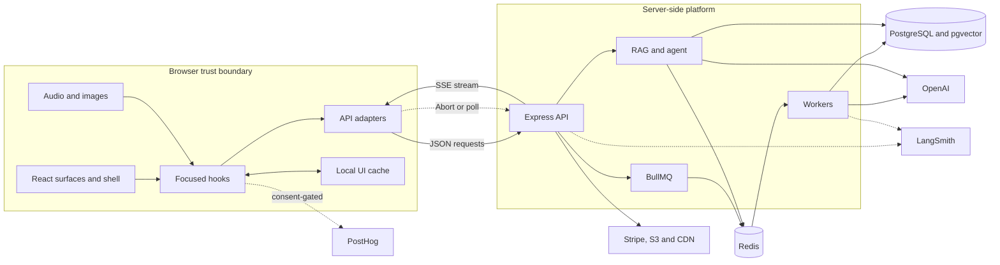
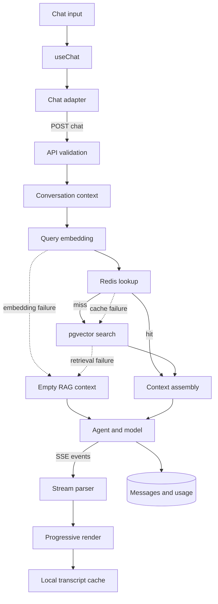
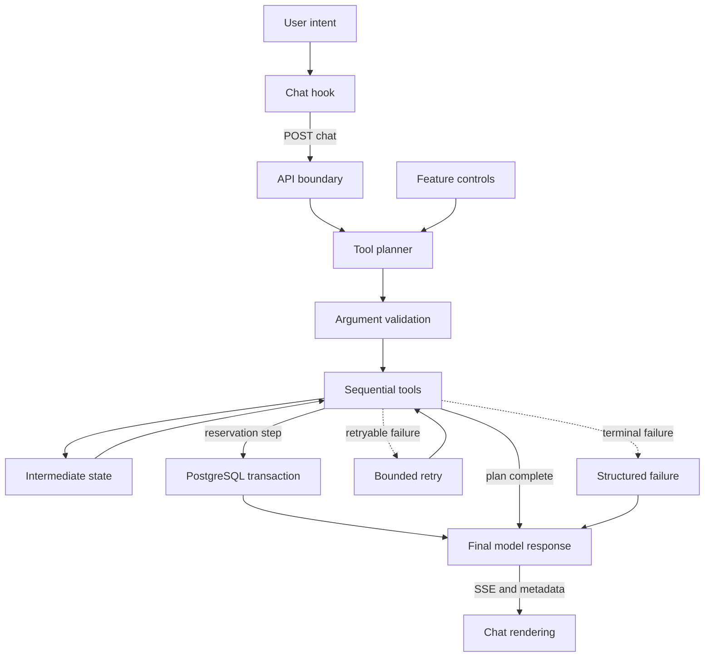
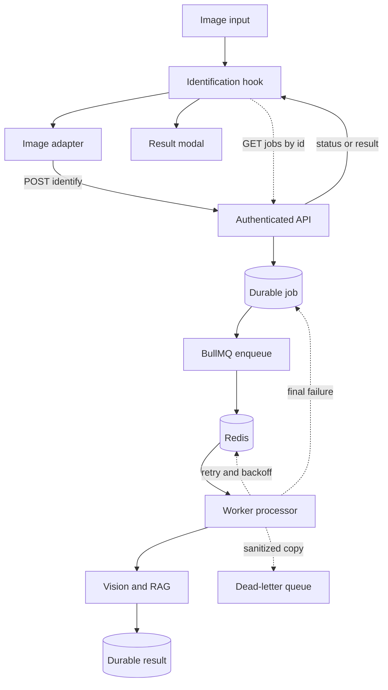
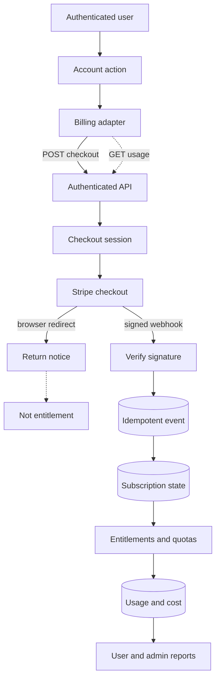

# Birdwatching AI UI

## 1. Project overview

This repository is the React 18/Vite browser application for Birdwatching AI, a Costa Rica birding and tour-assistance platform. It owns the product shell, public homepage, authenticated and visitor chat, tour cart and reservation entry, bird-image identification UI, voice capture, account and billing entry points, and an administrator operations surface.

The browser is deliberately not an AI runtime. It captures and validates user input, maintains ephemeral interaction state, consumes normalized HTTP/SSE contracts, and renders server-issued results. OpenAI calls, retrieval, tool execution, durable conversation state, reservations, quotas, billing webhooks, and private object-storage credentials belong to the [Birdwatching AI API](https://github.com/jsanchez556/birdwatching-ai-api).

The principal boundary is:

- React components render state and accessible interactions.
- Hooks coordinate browser APIs, state transitions, cancellation, persistence, and cross-surface actions.
- API adapters are the only browser HTTP boundary and validate server responses.
- The backend is authoritative for AI output and durable business state.

See [CONTEXT.md](./CONTEXT.md) for the repository source map and [docs/architecture.md](./docs/architecture.md) for more detailed render flows.

## 2. Capability status

Status is based on executable code, tests, and deployment wiring in this repository.

| Capability | Status | Evidence and boundary |
|---|---|---|
| Homepage, chat, account, cart, billing, identification, and admin surfaces | **Implemented** | Composed by [`App.jsx`](./src/App.jsx), [`pages/`](./src/pages), and [`useProductShell`](./src/hooks/useProductShell.js); covered by component and hook tests. |
| Progressive text chat over SSE | **Implemented** | [`chatApi.js`](./src/api/chatApi.js) consumes `start`, `chunk`, `replace`, `done`, and `error` events; [`useChat`](./src/hooks/useChat.js) reveals buffered text and finalizes metadata. |
| Client cancellation | **Implemented** | `AbortController` cancels the browser request; the backend contract propagates disconnect cancellation toward model execution. A cancelled generation is not resumable. |
| Conversation cache and hydration | **Implemented** | Scoped `localStorage` cache, invalid-value recovery, authenticated latest-conversation lookup, and conversation-by-ID hydration are implemented and tested. PostgreSQL remains authoritative. |
| Voice chat | **Implemented, optional** | `MediaRecorder` capture, framework-independent WAV conversion, raw upload to `POST /voice-chat`, response-audio URL resolution, and playback are wired. Browser support, permission, API feature availability, S3, and media delivery remain external prerequisites. |
| Bird identification | **Implemented, optional** | Authenticated URL/upload submission, cancellation, BullMQ job polling, uncertainty-aware result rendering, and tests exist. Model execution and queue ownership are server-side. |
| Tour cart and reservation entry | **Implemented** | Authenticated CRUD and reservation requests use backend adapters. Final availability, pricing, and reservation commits are server-authoritative. |
| Billing UI | **Implemented, provider-neutral** | Checkout and portal calls accept backend-returned redirect URLs. The UI neither verifies payment nor grants entitlement. |
| PostHog analytics and feature gates | **Implemented, optional** | Consent-gated browser initialization and event tests exist. Missing configuration disables export; server-side feature availability can also disable AI entry points. |
| Admin operations UI | **Implemented** | Admin metrics, errors, queue state, retry, account suspension, and temporary AI feature controls have strict adapter validation and UI tests. |
| Production static serving | **Implemented** | Vite build plus a tested Node static server with SPA fallback, compression, cache headers, health routes, structured logs, and bounded shutdown. |
| End-to-end browser automation and measured UX performance | **Not verified** | The repository has Jest/jsdom/React Testing Library coverage, but no checked-in browser E2E or performance benchmark suite. |

## 3. Architecture at a glance

| Layer | Responsibility | Important paths |
|---|---|---|
| Composition | Select the home, chat, or admin surface; attach focused controllers | [`src/App.jsx`](./src/App.jsx), [`src/pages/`](./src/pages) |
| Product shell | Authentication, overlays, cart coordination, feature access, billing returns, cross-surface actions | [`useProductShell.js`](./src/hooks/useProductShell.js) |
| Focused controllers | Chat, audio, voice upload, image jobs, cart, home content, admin data | [`src/hooks/`](./src/hooks) |
| Presentation | Semantic UI, dialogs, forms, messages, result cards, admin visualizations | [`src/components/`](./src/components) |
| Contract boundary | URL construction, auth headers, request encoding, envelope/SSE validation | [`src/api/`](./src/api) |
| Pure utilities | Storage recovery, conversation normalization, WAV encoding, reservation parsing | [`src/utils/`](./src/utils) |
| Analytics and flags | Consent-aware PostHog adapter and local/server feature decisions | [`src/analytics/`](./src/analytics), [`src/featureFlags/`](./src/featureFlags) |
| Styling | Semantic tokens, responsive layouts, overlays, chat, homepage, and admin styles | [`src/index.css`](./src/index.css), [`src/styles/`](./src/styles) |
| Runtime | Vite development/build and Node static artifact serving | [`vite.config.js`](./vite.config.js), [`server.js`](./server.js) |

`App.jsx` is intentionally composition glue. Stateful orchestration stays in hooks so pages remain understandable and HTTP behavior remains testable at the adapter boundary.

## 4. System architecture diagram

Shows how the React application crosses the browser/server trust boundary while keeping durable AI and business state on the backend.



Reading notes:

- The browser owns interaction state and transport adaptation; the API revalidates identity, authorization, quotas, and input.
- PostgreSQL is the durable source of truth. Browser storage and Redis are caches or coordination state.
- External services appear only at their relevant boundary: the browser exports consent-gated PostHog events and follows provider-hosted URLs returned by the API.

## 5. End-to-end request lifecycle

### Streamed chat

1. `ChatInput` trims input, blocks empty submission, and preserves Enter/Shift+Enter behavior.
2. `useChat` appends a user message and an in-progress assistant message, then creates an `AbortController`.
3. `chatApi.streamChatMessage` sends `POST /chat` with JSON, optional bearer auth, and `Accept: text/event-stream`.
4. The backend may load conversation context, run retrieval, plan and execute tools, and stream assistant text.
5. `chatStream.js` incrementally decodes SSE blocks. `useChat` buffers `chunk` content for progressive rendering; `replace` can replace guarded text.
6. `done` supplies the authoritative conversation ID and optional metadata such as UI actions, reservation confirmation, bird matches, sources, and usage/trace identifiers.
7. Final rendered state is cached locally unless the entry was explicitly ephemeral. Server persistence remains authoritative.
8. Stop generation aborts the fetch. Network, protocol, and server failures become user-facing messages; malformed envelopes or events are not rendered as partial trusted state.

### Image identification

1. An authenticated user supplies an HTTPS image URL or JPEG/PNG/WebP file.
2. The adapter submits JSON or the raw image body to `POST /birds/identify`.
3. A completed result is rendered immediately; a queued result is polled through `GET /jobs/:id`.
4. Polling ends on `completed`, `failed`, `not_found`, cancellation, or the hook’s terminal error handling.
5. The modal preserves the backend’s `identified`, `uncertain`, or `unknown` state and displays candidate evidence without converting uncertainty into a positive identification.

## 6. Core AI capabilities

The UI participates in AI workflows through contracts; it does not execute models.

- **Grounded chat:** renders streamed text and optional source/bird metadata returned by the API.
- **Agent-assisted booking:** renders guided `uiAction` controls and sends user choices back as ordinary chat turns. A reservation card is shown only from server metadata or a conservative legacy-text fallback, while retaining the original assistant message.
- **Multimodal identification:** accepts image input and renders structured candidates, observations, contradictions, missing evidence, and confidence.
- **Voice conversation:** converts browser recordings to WAV, sends contextual headers, and renders the returned transcript, answer, and MP3.
- **Response modes:** voice requests use `field_assistant` to ask the server for concise spoken output.

Prompt construction, retrieval, embeddings, model selection, usage accounting, and guardrails are backend concerns.

## 7. Frontend architecture

The product is a lightweight internal-surface application rather than a URL router:

- `HomeSurface` composes the homepage and lazy-loaded chat/identification overlays.
- `AuthenticatedChatSurface` provides the dedicated chat shell.
- `AdminDashboard` is lazy-loaded and available only to an authenticated admin state.
- `useProductShell` owns surface selection, overlay state, billing-return handling, cart/reservation entry, feature access, and cross-surface actions.
- `useAuth`, `useChat`, `useCart`, `useBirdIdentification`, and admin hooks own focused state machines.

Presentational components do not call `fetch`. API adapters normalize transport behavior and reject unexpected data before components receive it. This boundary limits the blast radius of backend contract drift.

Responsive behavior is mobile-first. Icon-only controls and loading states have accessible labels; dialogs use dialog semantics and Escape handling; message roles are visually distinct; inputs retain keyboard operation; and content is allowed to wrap without fixed-height transcript assumptions.

## 8. Backend architecture

The companion API owns all privileged and durable behavior:

- Express routing, validation, authentication/authorization, rate limiting, and normalized envelopes.
- OpenAI text, embedding, speech, and vision calls.
- RAG, conversational memory, agent planning, tool execution, and reservation transactions.
- PostgreSQL/pgvector, Redis caches, BullMQ queues/workers, S3/CloudFront, Stripe, LangSmith, and server-side PostHog.

The UI assumes the normal JSON envelope:

```json
{
  "success": true,
  "data": {},
  "meta": {}
}
```

The SSE chat endpoint is intentionally different: named `start`, `chunk`, `replace`, `done`, and `error` events carry JSON payloads. The cross-repository contract runner feeds the API’s production SSE helpers into the UI’s production parser without requiring providers or databases.

### Browser HTTP contracts

| Workflow | Method and path | Auth | Frontend behavior |
|---|---|---:|---|
| Homepage | `GET /homepage/hero`, `/tours`, `/birds/highlights`, `/birds/profile`, `/addons/transportation` | No | Validates normalized JSON; independent content failures degrade to visible loading/error state. |
| Chat | `POST /chat` | Optional | Consumes SSE; visitor/customer behavior is server-controlled. |
| Hydration | `GET /chat/latest`, `GET /chat/:conversationId` | Yes | Replaces local cached transcript only after envelope validation. |
| Voice | `POST /voice-chat` | Optional | Raw WAV body plus `X-*` context headers; validates JSON response and resolves media URL. |
| Identification | `POST /birds/identify`, `GET /jobs/:id` | Yes | JSON URL or raw image upload; polls queued work. |
| Authentication | `POST /auth/signup`, `/login`, `/refresh`, `/logout` | Varies | Stores returned access/refresh session locally; refreshes before expiry. |
| Profile | `PATCH /auth/profile`, `POST /auth/profile-image` | Yes | JSON name update or raw image upload. |
| Cart/reservations | `GET /cart`, `POST /cart/items`, `PATCH/DELETE /cart/items/:id`, `GET/POST /cart/reservations` | Yes | Server state is authoritative. |
| Billing | `POST /billing/checkout`, `/billing/portal`; `GET /billing/usage` | Yes | 15-second client timeout; redirects only to validated returned URL fields. |
| Feature availability | `GET /features/availability` | No | Requires the exact supported feature set and valid enable/expiry state. |
| Media | `GET /files/:folder/:filename` | No | Resolves safe relative media keys when a direct CDN base is not configured. |
| Admin | `GET /admin/*`, `POST /admin/jobs/:id/retry`, feature enable/disable, user suspend/unsuspend | Admin | 15-second timeout, strict shapes, safe per-status messages, explicit confirmations. |

## 9. RAG and conversational memory

RAG is entirely server-side. The UI may receive source metadata and `birdMatches`, but never creates embeddings, queries pgvector, or treats a browser cache as knowledge.

### RAG request flow

Shows how the frontend submits a chat turn, consumes a grounded or degraded response, and keeps its local transcript separate from server memory.



Reading notes:

- Embeddings, retrieval, context assembly, model execution, and durable persistence stay behind the API boundary.
- Redis failure bypasses the cache; retrieval failure can continue with an empty, explicitly degraded RAG context.
- The browser accepts source metadata but currently does not render general RAG sources; its local transcript is not durable knowledge.

Conversation state has two tiers:

- **Browser cache:** rendered messages, conversation ID, customer context, and limited conversation metadata in a user-scoped `localStorage` key. Reads and JSON parsing are guarded; invalid data is discarded.
- **Durable memory:** authenticated conversations and messages in backend PostgreSQL. On startup the hook uses a cached transcript first, then a known conversation ID, then `GET /chat/latest` for authenticated users without scoped local state.

Reservation-entry chat can be ephemeral to avoid mixing a one-off structured booking entry with the user’s ordinary cached conversation. Local deletion does not imply server-side deletion; retention and data-export behavior are documented in [docs/privacy-retention.md](./docs/privacy-retention.md).

## 10. Agent orchestration and tool execution

The browser does not invoke tools directly. It submits user intent and renders constrained output metadata:

- Guided controls send a natural-language choice back through the normal chat path.
- Raw tool arguments and internal execution traces are not required for public rendering.
- Tour selection, pricing, transportation, availability, and reservation status remain backend-authoritative.
- A positive assistant sentence alone is not treated as a transactional commit when structured reservation metadata is absent.

### AI agent tool-execution flow

Shows how guided UI choices enter the server-side planner and return only after controlled tool execution.



Reading notes:

- The browser sends intent, not executable tool calls; planning, validation, retries, and tool state are server-owned.
- A tool failure is returned as structured context so the final response cannot safely claim an uncommitted booking.
- The reservation card prefers successful server metadata; model text alone is not transactional proof.

Tool registration, argument validation, retries, PostgreSQL reservation semantics, and multi-step planning are documented in the backend repository.

## 11. Streaming and multimodal workflows

### Streaming and cancellation

`ReadableStream` bytes are decoded incrementally. The parser tolerates event blocks split across network chunks and flushes the final buffer. `useChat` separates network receipt from visual reveal so fast server chunks do not cause abrupt rendering. Cancellation aborts active chat, voice, or identification requests; navigating or changing identity also prevents stale work from mutating the new state.

### Voice

`useAudioRecorder` requests microphone access, releases tracks after recording, and exposes permission/capture failures. [`audioEncoding.js`](./src/utils/audioEncoding.js) decodes captured audio and writes PCM WAV independently of React. `useVoiceChatUpload` sends the WAV through the adapter; the response audio is resolved through `VITE_CLOUDFRONT_BASE_URL` or the backend media endpoint.

Limitations: MediaRecorder and Web Audio support vary by browser; voice is a synchronous request rather than a streaming duplex session; generated audio requires backend object storage and public delivery configuration.

### Images

The identification modal supports pasteable URLs, uploads, and mobile camera selection. Client validation improves feedback but is not a trust boundary; the API repeats type, size, quota, auth, and schema checks. The browser does not retain uploaded image bytes in local conversation storage.

## 12. Background processing and caching

The UI does not run background workers. It observes asynchronous bird-identification state by polling the authenticated job endpoint.

### Asynchronous worker flow

Shows the frontend-visible lifecycle of queued bird identification and the server-side work hidden behind job polling.



Reading notes:

- The browser keeps only the job ID and polls; PostgreSQL owns durable status and results.
- Redis carries BullMQ work but is not the source of truth for the identification result.
- Retries and dead-letter handling are server-side; the modal renders safe failed, missing, or uncertainty states.

Browser caching is limited to:

- `localStorage` session and rendered-conversation state;
- an in-memory promise cache for resolved relative media keys;
- the browser’s normal static-asset cache, directed by `server.js`.

Redis, BullMQ retries, dead-letter handling, AI response caching, embedding caching, and retrieval caching belong to the API/worker deployment.

## 13. Observability, analytics, and AI evaluations

Browser PostHog export is initialized only when `VITE_POSTHOG_ENABLED=true`, a public project key exists, and cookie consent permits analytics. Identification uses authenticated user ID plus role/plan traits; logout resets identity. Provider failures do not block user workflows.

The production static server emits JSON request-completion logs with method, normalized route, status, and duration. It does not provide distributed traces.

AI traces and evaluations are backend-owned. The UI exposes returned trace/usage metadata only where a component contract needs it. No checked-in frontend test measures model quality. The backend currently has deterministic scorer tests and a real-output evaluation gate, but its checked-in real-pipeline quality baseline is explicitly unavailable.

## 14. Billing and AI cost governance

The frontend is a presentation and redirect boundary:

- It asks the backend for hosted checkout or portal sessions.
- It validates the normalized response and required URL field.
- It shows billing-return status as informational UI only.
- It never stores provider customer/subscription IDs, price IDs, webhook secrets, or payment credentials.
- It never grants plan access from a redirect query parameter.

### Billing and subscription lifecycle

Shows why the hosted checkout redirect is presentation state while signed webhook processing establishes entitlement.



Reading notes:

- The browser validates provider-neutral URLs but never stores provider IDs or decides subscription state.
- Only a verified webhook updates the durable subscription; a success redirect is informational.
- Quotas and cost records are enforced and calculated server-side, then exposed through user/admin reporting contracts.

Quotas, usage reservations, token/cost persistence, subscription synchronization, temporary feature controls, and feature-economics reporting are backend responsibilities. The UI renders returned availability and admin data; it does not enforce cost limits on its own.

## 15. Reliability and security considerations

Implemented controls:

- API adapters centralize bearer headers, JSON encoding, URL construction, envelope validation, and friendly errors.
- Chat input and customer context are validated before submission; the server must validate again.
- Streaming, voice, identification, admin, and billing work supports cancellation or bounded client timeouts where implemented.
- Stored JSON reads/writes/removals are guarded so unavailable or corrupt storage does not crash rendering.
- Relative media paths reject traversal segments before URL construction.
- Static serving rejects path traversal, sends `X-Content-Type-Options: nosniff`, applies explicit cache policy, and bounds graceful shutdown.
- Analytics is consent-gated and optional.

Trust and privacy limitations:

- Access and refresh tokens are stored in `localStorage`; this is convenient for the current architecture but increases the consequence of an XSS defect compared with an HttpOnly-cookie design.
- `VITE_*` values are public build-time configuration. Secrets must never be placed in them.
- Frontend validation is usability logic, not authorization. Roles, quotas, feature controls, ownership, payment state, and reservation validity must be enforced server-side.
- The app has no service worker/offline mode and no browser E2E security test suite.
- A stopped HTTP stream may already have caused server-side non-cancellable work; transactional side effects must be made safe by the API.

## 16. Testing strategy

Run all deterministic frontend tests with `npm test`.

| Test class | Coverage |
|---|---|
| Component tests | Auth/customer forms, chat input/messages, identification output, homepage content, cart, admin dialogs and operations. |
| Hook tests | Auth refresh/persistence, chat hydration/stream/cancellation, audio recording, voice and image orchestration, cart, feature availability, product shell, admin loading/actions. |
| API contract tests | Envelope validation, auth headers, request encoding, timeouts, response normalization, media resolution, SSE parsing behavior. |
| Utility tests | Storage recovery, conversation state, audio encoding, cookies, reservation normalization. |
| Static runtime tests | Path safety, health routes, cache/compression behavior, and shutdown configuration. |
| Cross-repository contract | A runner exists at `scripts/test-chat-contract.js`, but the current command is **not passing**: Node ESM cannot resolve the extensionless `chatStream.js` utility import, and the runner’s expected normalized shape has drifted. Treat this check as partial until repaired. |
| CI | Pull requests are configured to run `npm ci`, `npm test`, `npm run build`, and the cross-repository chat contract; the contract defect above prevents claiming a fully passing workflow from this checkout. |

Gaps: there is no checked-in Playwright/Cypress suite, visual regression suite, load test, accessibility audit runner, or production telemetry assertion.

## 17. Local development

### Prerequisites

- Node.js 22, matching CI and the backend engine requirement
- npm
- A running backend for live product workflows; by default the proxy expects `http://localhost:3000`

### Install and configure

```bash
npm ci
```

Create `.env` without secrets:

```dotenv
VITE_API_URL=
VITE_API_PROXY_TARGET=http://localhost:3000
VITE_CLOUDFRONT_BASE_URL=
VITE_POSTHOG_ENABLED=false
```

Leaving `VITE_API_URL` empty makes adapters use relative URLs and the Vite proxy. Start the companion API and its prerequisites using that repository’s README.

### Start, test, and build

```bash
npm run dev
npm test
npm run build
npm run preview
```

`npm run start` serves an existing `dist/` with the production Node static server. It does not build first.

`npm run test:chat-contract -- --api-root ../birdwatching-ai-api` is the configured cross-repository check, but it currently fails for the ESM/shape drift described in [Testing strategy](#16-testing-strategy). It is documented for diagnosis, not as a passing onboarding step.

## 18. Environment variables

All `VITE_*` values are embedded into browser assets and must be treated as public.

### Frontend build and development

| Variable | Required | Used by | Purpose | Safe local default or notes |
|---|---:|---|---|---|
| `VITE_API_URL` | Production | API adapters and Vite proxy selection | Public API origin baked into the bundle | Empty locally for relative proxy calls; trailing slash is removed. |
| `VITE_API_PROXY_TARGET` | No | Vite dev server | Proxy target when `VITE_API_URL` is empty | `http://localhost:3000`. |
| `VITE_CLOUDFRONT_BASE_URL` | No | Media adapter | Build public media URLs directly from safe object keys | Empty uses `GET /files/:folder/:filename`. |
| `VITE_POSTHOG_ENABLED` | No | Browser analytics | Permit consent-gated PostHog initialization | `false`. |
| `VITE_POSTHOG_KEY` | When analytics is enabled | Browser analytics | Public PostHog project key | No default; never use a private server key. |
| `VITE_POSTHOG_HOST` | No | Browser analytics | PostHog ingest origin | `https://us.i.posthog.com`. |
| `ALLOWED_HOSTS` | No | Vite preview | Comma-separated additional preview hosts | Empty. This does not configure the production Node server. |

### Static runtime

| Variable | Required | Used by | Purpose | Safe local default or notes |
|---|---:|---|---|---|
| `PORT` | No | `server.js`, Vite preview script | Listening port | Static server: `3000`; preview: `4173` through the package script. |
| `STATIC_SERVER_GRACE_MS` | No | `server.js` | Delay before active sockets are forced closed | `10000`; positive number. |
| `STATIC_SERVER_HARD_TIMEOUT_MS` | No | `server.js` | Overall shutdown deadline | `15000`; must exceed the grace period. |

Backend database, Redis, OpenAI, Stripe, S3, LangSmith, JWT, and server-side PostHog variables do not belong in this repository.

## 19. Repository structure

```text
src/
  analytics/       Consent-aware browser analytics
  api/             HTTP and SSE contract adapters
  components/      Presentational product and admin UI
  featureFlags/    Browser feature definitions and local flag access
  hooks/           Stateful orchestration and browser side effects
  pages/           Surface composition
  styles/          Responsibility-focused CSS
  utils/           Storage, audio, reservation, and normalization helpers
  App.jsx          Active-surface composition
  main.jsx         React entry point
scripts/
  test-chat-contract.js
docs/              Architecture, API, memory, deployment, privacy, and conventions
server.js          Production static server
vite.config.js     Build and development proxy
railway.json       Railway build/start policy
```

## 20. Deployment and operations

The checked-in Railway configuration runs:

```bash
npm run build
npm run start
```

The build creates hashed Vite assets in `dist/`. `server.js` serves those assets with long immutable caching for hashed files, shorter caching for other assets, no-cache HTML/SPA fallback, Brotli or gzip when accepted, and `/health`, `/health/live`, and `/health/ready` probes. Readiness becomes unavailable during shutdown but does not probe the backend.

Production must set `VITE_API_URL` before build and configure the API’s `CORS_ORIGINS` to allow the frontend origin. A build-time variable change requires a rebuild. Railway restarts failed processes up to the configured limit; the repository does not define autoscaling, an SLO, or multi-region behavior.

Operational verification:

```bash
npm ci
npm test
npm run build
npm run start
```

Then verify static health, a browser navigation, backend connectivity, streamed chat cancellation, and any optional voice/image/billing provider path enabled in that environment.

## 21. Architectural tradeoffs, limitations, and future improvements

Current tradeoffs:

- Internal surface selection keeps dependencies and composition small, but surfaces are not independently addressable URLs.
- Local transcript caching improves reload continuity, but duplicates server data and requires identity-scoped invalidation.
- Progressive reveal improves readability, but visual completion can lag network completion slightly.
- Raw browser audio conversion avoids requiring WebM support on the API, but consumes client CPU and memory.
- Polling makes queued identification simple and observable, but is less efficient than push updates.
- Strict adapter validation prevents partial corrupt state, but contract changes require coordinated releases.

Evidence-based limitations:

- Authentication tokens are browser-readable.
- Optional provider workflows cannot work without matching backend and provider configuration.
- The static health endpoint does not establish API readiness.
- Tests are deterministic and extensive but stop short of real-browser, performance, and live-provider verification.
- No performance, scale, availability, AI-accuracy, or cost outcome is established by this repository.

Plausible future directions, not current behavior:

- Move session renewal to secure HttpOnly cookies with corresponding CSRF controls.
- Add URL-addressable surfaces if deep links and browser navigation become product requirements.
- Add browser E2E, automated accessibility, visual regression, and stream interruption tests.
- Replace job polling with an authenticated push channel when asynchronous workload volume justifies it.
- Generate shared contract types or schemas from the API while preserving runtime validation at the browser boundary.
